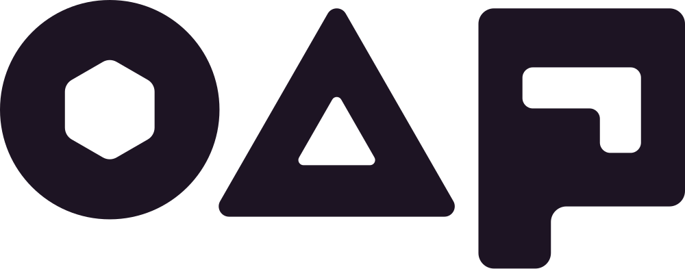

<p align="center">
  <picture>
    <!-- "light" and "dark" name the MARK's colour, not the page's: the light
         mark sits on GitHub's dark theme and the dark mark on its light theme. -->
    <source media="(prefers-color-scheme: dark)" srcset="docs/assets/brand/oap-logomark-light.svg">
    
  </picture>
</p>

# Open Agent Primitives

**A secure way to run enterprise AI agents.**

OAP is a set of building blocks for constructing and running enterprise agents.
A primitive is a concern every agent has to solve, whatever it does. OAP names
six:

- Agent definition
- Safe tools
- Identity & credentials
- Authorization
- Channels & continuity
- Memory & knowledge

Each ships with a working implementation, and every agent is composed from them.
OAP runs in your own Kubernetes cluster, on the models and infrastructure you
choose.

An enterprise agent holds production credentials and does work the business
depends on. Trusting it with that work means answering four questions: what it
can reach, who granted that access, what happens when a tool result tells it to
do something else, and what is exposed if one component is compromised. OAP is
designed for those concerns.

## The problem this solves

A credential is the unit of access, and it is usually broader than the task. A
token that reaches one git repository normally reaches every repository, and an
integration built to expose a service exposes all of it. An agent inherits that
whole surface, and the distance between what a task needs and what its
credentials permit grows as agents take on more work, because that is when they
hold production credentials, touch production systems, and read content that
carries instructions.

A model cannot deterministically separate instructions from data, so its
judgment is not a dependable place to enforce a boundary. Hardening the prompt
does not change that, because a prompt is an instruction rather than an
enforcement point. A permission check at the edge, deciding who may start an
agent, does not constrain what that agent reaches once it is running across data
with many different owners.

Every control in OAP therefore sits outside the model. The platform decides
before the call, and the decision does not depend on the agent's cooperation.

|                                     | Typical agent platform             | OAP                                     |
| ----------------------------------- | ---------------------------------- | --------------------------------------- |
| What an agent can reach             | Whatever its credentials allow     | Exactly what you granted                |
| Who decides an action is allowed    | The model, in the moment           | The platform, before the call           |
| An injected instruction mid-session | Can redirect the agent             | Cannot widen what it's authorized to do |
| Tool credentials                    | Shared across tools in one sandbox | Held only by the tool that uses them    |
| Restricting an MCP server           | Needs a narrow upstream token      | Declared by you, enforced per call      |
| Revoking access                     | Rotate credentials, redeploy       | One permission graph call               |
| The audit log                       | Append-only, enforced by the store | Signed, chained, verifiable offline     |

## What makes it secure

Twenty-seven controls, grouped into six areas. Each area below links into the
[security model](docs/security-model.md), which documents every control and
names the package that implements it.

### 1. Every action is authorized

Authorization is evaluated per action against a relationship graph that mirrors
ownership in your organization: who owns an account, who is on which team, who
shared what. Relationships can be written from source systems as the agent runs,
so a decision reflects the current state of those systems rather than a cached
copy. A failed check can become an approval request routed to whoever holds
authority over the resource.

- **What is checked.** Tool calls, interactions, memory access, lookups, and
  preferences all go through the graph.
- **Operation-level rules.** One agent can be read-only for one team and
  read-write for another, instead of building a separate agent per audience.
- **Directory sync.** Group memberships from Slack, GitHub, and 1Password sync
  into SpiceDB, so permissions follow your organization automatically.
- **Four identity modes.** An agent acts as itself or as the session's user, and
  that choice can instead be made by the user when the session opens, with or
  without a recommendation to confirm. Per-user credentials are held by the
  platform.
- **Multiplayer sessions.** Joining a session, directing it, and running
  sensitive tools can each require approval.

### 2. Injected instructions cannot widen what an agent may do

Rather than relying on the model to recognize an injected instruction, OAP
places the decision outside the model.

- **Plan gating.** The agent states what it intends, a person approves that
  scope, and every later action is checked against the approved plan. Injected
  text can change what the model wants to do. It cannot change what the model is
  allowed to do.
- **Slots.** A session commits to the specific resource it is working on, as a
  pinned relationship. A different resource is refused unless a human approves a
  plan amendment that moves the pin and revokes the old resource's access — and
  a slot set `rebind: never` admits no move at all.
- **Approvals the model cannot reword.** The platform generates the description
  of the action from the call itself. The model contributes only its reasoning,
  so it cannot restate the action in different terms.
- **Tool specs.** Declare which operations and which resources an MCP server or
  CLI exposes to an agent, enforced in code at call time. A read-write
  integration becomes read-only without needing a read-only token.

### 3. Data reaches only its authorized audience

- **Leakage tracking.** Tool responses are tagged with their origin and the tags
  travel with the data, so the platform can check where data came from against
  who will receive it before anything leaves.
- **Slot-scoped memory.** Sessions share memory only when bound to the same
  resource, so one customer's context does not reach another customer's
  sessions. Nothing is shared by default.
- **Secret scrubbing.** Mark a tool output as a secret and the model receives an
  opaque handle. The platform substitutes the real value outside the model.

### 4. Least privilege by default

- **Opt-in capabilities.** Every toolkit, tool spec, and capability an agent has
  is one someone added deliberately, so a review covers what was added rather
  than what was left enabled.
- **A sandbox per tool.** Each tool holds only its own credentials, so a
  compromised tool cannot borrow another's access. The orchestrating agent never
  holds them at all.
- **Sub-agents request their own permissions.** Delegation narrows access
  instead of copying it.
- **Sidecar toolboxes.** Run arbitrary code as an MCP server in its own sandbox,
  started and stopped with the session.

### 5. Control and oversight

Administrators set requirements and defaults at the cluster, namespace, or
agent-class level, and agents inherit them without being able to opt out.
Revocation works by removing a relationship, so it takes effect everywhere at
once with no credential rotation or redeploy. The audit log is append-only, and
each entry is signed and hash-chained, so modification, reordering, and
truncation are detectable; `oap audit verify` checks a session's chains offline.
Skills, containers, and MCP servers can be pinned to approved versions. Budgets
cap turns, spend, and run time. Pre- and post-call hooks enforce your own
policies and can trip a circuit breaker.

### 6. Isolation in the platform itself

Each content type passes through a sanitizer written for that type's risks, and
rendered output is contained under a Content Security Policy without cookie
access. The session runner, the operator, and each sanitizer run in separate
pods, with micro-VM backing where the cluster provides it. Components dial the
control-plane bus with individually minted credentials that grant only their own
session's subjects. Each agent ships as one OCI-compliant package, so
installation can be gated and reviewed like any other artifact.

## Everything else

The capabilities below are common to agent platforms. OAP includes them; they
are listed here so the set is complete.

- **You choose the model.** Anthropic, OpenAI, or OpenRouter, swappable per
  deployment.
- **You choose the infrastructure.** A laptop, a local cluster, or your own
  Kubernetes: GKE, EKS, AKS, or self-managed.
- **Channels.** Slack, browser, CLI, GitHub, or a signed webhook trigger.
- **Memory and knowledge graph.** Structured recall, ranked search, and
  graph-native queries over what an agent has learned.
- **Built in and swappable.** The runner, authorization, approvals, sandboxing,
  credential handling, memory, and audit all ship built in, and every one can be
  swapped for something your organization already runs without rebuilding the
  platform around it.

## Quick start

### 1. Run it locally

Pick the path that fits where you want to run OAP.

**Desktop (macOS, Apple Silicon)** is the fastest way to a working local OAP. It
runs the whole project in a lightweight Linux VM, reachable only from your Mac,
with a menubar app for chats, sessions, the admin dashboard, and agent
installation. No Kubernetes to set up yourself.

```bash
mage desktop:all
open build/desktop/out/oap.app
```

On first launch, pick a model provider, enter its API key, and set a local admin
password. OAP provisions the VM, configures the platform, and installs a demo
agent.

Desktop is single-player: good for trying OAP and for developing and demoing
agents. Use Kubernetes for anything durable or shared.

**Local Kubernetes** installs onto a `kind` cluster for development:

```bash
mage build:oap
kind create cluster --name oap-dev
./bin/oap init --local --pinning-mode=warn --wizard
```

`oap init` builds and loads images, installs OAP, waits for the platform to come
up healthy, and walks you through security settings and model configuration.

### 2. Install your first agent

Install the pirate example. Its captain installs the vampire translator as a
private dependency automatically, with no separate manifest apply and no extra
credential to hand it:

```bash
./bin/oap agent install examples/pirate-subagent/pirate-captain
./bin/oap agent chat pirate-captain
```

`oap agent install` validates and installs the whole agent graph as one unit:
definitions, dependency, configuration, and install-time questions. Then
`oap agent chat` opens an interactive terminal conversation with the captain.
Ask for both a pirate and a vampire response to see it delegate to the private
child agent.

### 3. Pick a model provider

OAP supports Anthropic, OpenAI, and OpenRouter. Set the default during
`oap init --wizard`, or change it later through agent settings. Nothing about an
agent's definition hardcodes a provider.

### 4. Move to a shared or managed cluster

OAP installs into an existing shared or managed Kubernetes cluster the same way
it installs locally. These profiles use durable Postgres-backed storage and
images from your own registry. You'll need a registry, external routing with two
distinct origins, and a durable artifact store (GKE can provision its own
bucket; EKS, AKS, and others take an `s3://`, `azblob://`, or `gs://` URL).

```bash
mage build:oap
./bin/oap init --pinning-mode=warn --wizard --hostname-suffix=my.web.hostname
```

`oap init` detects GKE, EKS, or AKS from the cluster when it can, and prompts
for whatever it can't. Pass `--cluster-kind` to skip detection, or provide
infrastructure choices directly:

```bash
./bin/oap init --cluster-kind=eks \
  --image-registry=<your-registry> \
  --artifact-store-url=s3://your-oap-bucket \
  --pinning-mode=warn --wizard \
  --hostname-suffix=my.web.hostname
```

See the [full deployment guide](docs/operating/deploy-to-a-cluster.md) for OIDC,
existing TLS issuers, private routing, cloud-specific storage, and air-gapped
registries.

### 5. Bring your team in

Agents run wherever your team already works: Slack, the browser, the CLI,
GitHub, or triggered by a signed webhook from another system. Connect a channel
with its own interactive wizard:

```bash
./bin/oap channel create --kind slack
```

`oap agent install` walks the same wizard automatically for any channel a bundle
declares, so installing an agent can connect its channel in one step. Once it's
connected:

```bash
./bin/oap channel list          # what's wired up
./bin/oap channel test <name>   # confirm it can still reach the channel
./bin/oap channel show <name>   # inspect one channel's config and status
```

Approval requests land in that same surface, a Slack thread or the browser
session, wherever the conversation already is, so nobody has to leave it to
grant or deny an action.

### 6. Turn on the controls

The security model above is configurable. Cluster-wide defaults (circuit
breakers, rate limits, data-volume budgets, dependency pinning, prompt-injection
detection, URL allow-listing) are set with their own wizard:

```bash
./bin/oap settings wizard             # interactive; --defaults for a secure baseline, --dry-run to preview
```

Dependencies (MCP servers, sidecar toolboxes, skills, toolkits) are pinned to a
known-good identity, and drift is reported:

```bash
./bin/oap pin status                  # every pinned dependency: strength, digest, drift, age
./bin/oap pin diff <kind> <name>      # compare the pinned baseline against what's live
./bin/oap pin update <kind> <name>    # accept a new baseline after you've reviewed it
```

`--pinning-mode` (`off`, `warn`, `approve`, or `block`) sets how strictly
`oap init` and `oap install` seed the cluster to hold agents and tools to their
pinned versions, from not gating at all up to blocking a drifted dependency
outright. And because the audit log is signed and hash-chained, not just
written, you can check it independently of whoever wrote it:

```bash
./bin/oap audit verify <session>      # recompute and verify a session's audit chain offline
```

## Build an agent by talking to an agent

You don't have to start with manifest files. **Agent Builder is an OAP agent
whose job is to create other agents.** Describe what you need in plain language
and it identifies tools, connects accounts through the platform, defines what
the new agent may do or must ask permission for, builds it, and lets you test it
live.

Each build happens in an isolated workshop. The draft can't touch your live
agents, and the builder can't install it into the real environment. When you're
satisfied, you get a portable `.oap` bundle and can submit an installation
request for an administrator to review.

`oap init` leaves Agent Builder off by default, because there is no safe default
for who's allowed to start it. Enable it after initialization by naming the
people or groups allowed to use it:

```bash
./bin/oap install --cluster-kind=local \
  --builder-starters user:$(./bin/oap identity canonical-id you@example.com)
```

Agent Builder is subject to every control in the security model, like any other
OAP agent. It has broad freedom inside its temporary workshop and no authority
outside it.

## Read the docs

The docs are at [openap.org/docs](https://openap.org/docs). To run them locally
instead:

```bash
cd site
pnpm install
pnpm dev
```

Then open [http://localhost:5179](http://localhost:5179) for installation
guides, Agent Builder walkthroughs, security concepts, operations, and the CLI
and CRD reference.

For architecture and implementation:

- [`docs/security-model.md`](docs/security-model.md) — all twenty-seven security
  controls, and the package implementing each.
- [`PRIMITIVES.md`](PRIMITIVES.md) — the six primitives and where each one's
  code lives.
- [`docs/owasp-agentic-top10-coverage.html`](docs/owasp-agentic-top10-coverage.html)
  — this codebase mapped against the OWASP Top 10 for Agentic Applications.
- [`docs/operating/deploy-to-a-cluster.md`](docs/operating/deploy-to-a-cluster.md)
  — production cluster deployment.
- [`AGENTS.md`](AGENTS.md) — repository conventions and contributor guidance.

## Defense in depth, enforced by code

To misuse an OAP agent, an attacker has to get past a plan a human approved, a
slot that cannot be silently reopened — a different instance needs a human's
approval, and `rebind: never` needs a new session — a tool lens that cannot be
widened, an authorization check on every call, and a sandbox that never held the
credential in the first place. None of them is sufficient alone, and each is
built on the assumption that the others may fail.

## Contributing

See [`CONTRIBUTING.md`](CONTRIBUTING.md) to get set up, and
[`CODE-OF-CONDUCT.md`](CODE-OF-CONDUCT.md) for how we work together. OAP is
licensed under [Apache 2.0](LICENSE), with separately licensed materials listed
in [third-party notices](THIRD_PARTY_NOTICES.md). Report vulnerabilities through
the [security policy](SECURITY.md).
